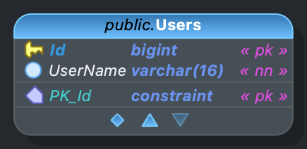
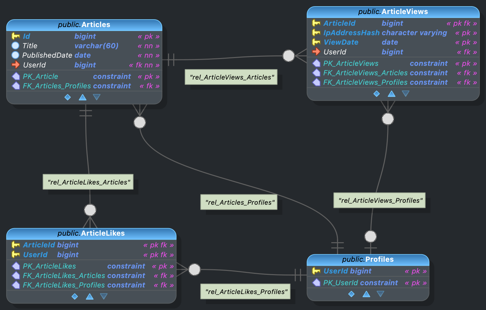

# rest_articles_axum

_`rest_articles_axum`_ _is a blogging platform_

## Tech

`Rust axum server` using `DDD + Vertical Slices` and `CQRS` with `gRPC + REST Swagger API` module, `Identity` module, `HTMX Web` module + `Next.js Web` module extension, `MongoDB + PostgreSQL` databases and `Unit + e2e tests` currently under `2000 LOC`.

## Run

0. Ensure `MongoDB` running on port `27017`
1. `cargo run`
2. `npm run dev`
3. Go to [`localhost:3000`](http://localhost:3000)

## Test

- `cargo test` for rust unit tests (`api + identity` modules)
- `Run` first, then `cd e2e-playwright && npx playwright test` for e2e tests (`api + web + identity` modules)

## cloc

`cloc --exclude-dir=target,.next,node_modules,docs,assets,public,tests-examples,playwright-report,test-results --not-match-f=".*\.(json|md|toml)$" --not-match-f="fake_mongo_repository.rs" --not-match-f="multiplex_service.rs" --by-file-by-lang .`

| Language         |    files |    blank |  comment |     code |
| :--------------- | -------: | -------: | -------: | -------: |
| Rust             |       36 |      128 |       94 |     1210 |
| TypeScript       |        7 |       27 |       49 |      199 |
| Protocol Buffers |        5 |       20 |        0 |       61 |
| HTML             |        3 |        3 |        0 |       37 |
| CSS              |        3 |        4 |        0 |       36 |
| JavaScript       |        2 |        2 |        2 |       10 |
| --------         | -------- | -------- | -------- | -------- |
| SUM:             |       56 |      184 |      145 |     1553 |

## Databases

### postgres_identity

### postgres_api

## TODO

- implement and use postgres repository/orm solution
- implement e2e testing
- implement an event sourcing solution
- cleanup (unnecessary clones, wrong types, strange patterns, rustify code?)
- implement auth and secure endpoints + update swagger with auth
- implement logging
- implement transactions
- implement more complex endpoints and entities with refs?
